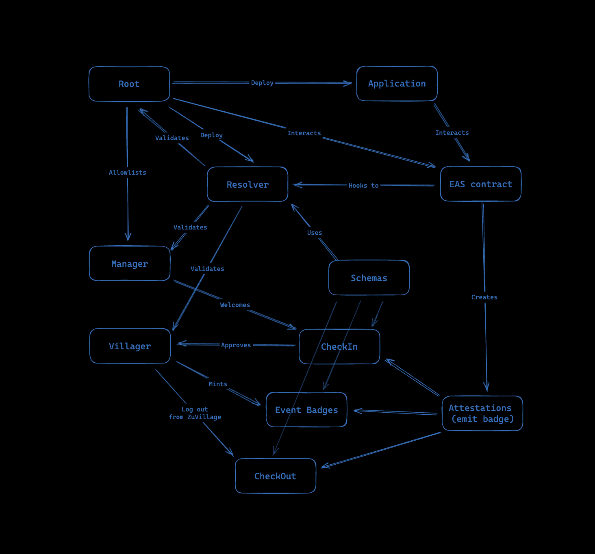

# Trustful-Zuzalu

Trustful is a cutting-edge reputation aggregator designed to mitigate the risks of plutocracy and bribery within DAOs. By matching governance and efforts through a transparent and decentralized reputation aggregator system, Trustful enhances organizational efficiency and promotes fairer and onchain data-based decision-making processes.

Trustful aims to revolutionize governance in DAOs by providing a seamless reputation aggregator system. Leveraging the principles of "Valocracy," Trustful uses blockchain technology to create a new social, economic, and political framework that empowers communities and individuals. The platform allows DAOs to define reputation based on their unique values, ensuring that aggregated data aligns with organizational standards and members' contributions.

## Pre-Requisites

- node.js installed (developed on LTS v18)
- typescript installed (developed on v5.3.3)
- bun or pnpm or yarn or npm installed
- Web3 Wallet installed in your browser

## Installation

### Forkin the repository

Fork this repository by:

1. Clicking in the arrow aside from the `fork`
2. Unmark the option `Copy the main branch only`
3. Click `Create fork`

### Cloning the repository

Open the VsCode or other IDE editor, and enteder the following command in the cmd:

`git clone https://github.com/YourUserName/trustful-zuzalu.git`

### Instaling dependencies

Install all package dependencies by running:

`bun install`
or
`pnpm install`
or
`yarn install`
or
`npm install`

### Configure the `.env.example` file

1. Remove the `.example` from the `.env.example` file name
2. Add your API keys in the `.env` file
3. In case you do not have it, just create one by following the steps on the [WalletConnect dashboard](WalletConnect dashboard)

NEXT_PUBLIC_WALLETCONNECT_PROJECT_ID = "Project ID needed for WalletConnect v2 here";

### Running the application

First, run the development server:

`bun dev`
or
`pnpm dev`
or
`yarn dev`
or
`npm run dev`

Open http://localhost:3000 with your browser.
